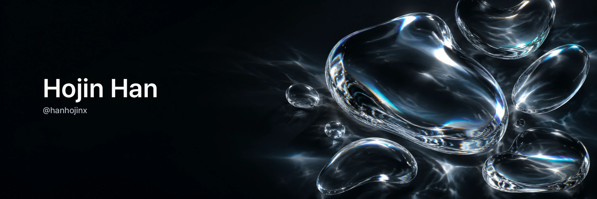

 

<!-- ═══════════════════════  About  ═══════════════════════ -->
### About

- Now conducting research on **LLM Provenance**
- Currently interested in **Agentic AI**
- Always open to conversations about **Security for AI & AI for Security**
- Contact: **seupjak@korea.ac.kr**

 

<!-- ═══════════════════════  Tech Stack  ═══════════════════════ -->
### Tech Stack

 

<!-- ═══════════════════════  GitHub Stats  ═══════════════════════ -->
### Activity

  
  

 

<!-- ═══════════════════════  Connect  ═══════════════════════ -->
### Contact

